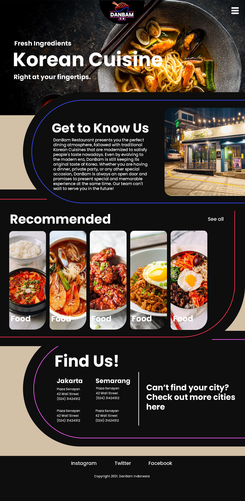

# DanBam

This is a final semestral project for our Human Computer and Interaction course at BINUS University.

## Intro
DanBam is a restaurant that has gone viral in Korea. Currently, DanBam has several branches all over Korea. DanBam Restaurant offers a menu of traditional Korean food packaged in a modern way.

With technological developments, DanBam plans to expand their reach through online media, which in this case is by making a website. First, DanBam must create a logo and company website that represents DanBam’s image. With this website's existence, DanBam hopes they can improve their service towards their customers. DanBam entrusts you as a web designer to design and create their logo and company website.

View of Home Page:

